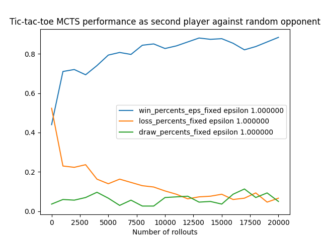

### Background

Monte Carlo Tree Search is a technique used for learning to make decisions. See [Wikipedia](https://en.wikipedia.org/wiki/Monte_Carlo_tree_search) for more details. This is a simple implentation that learns to play tic-tac-toe as either first or second player..

### Usage

## Running the main runner

`g++ game.cpp runner.cpp tic-tac-toe.cpp --std=c++17`

## Running unit tests

`g++ game.cpp tic-tac-toe.cpp catch_amalgamated.cpp test_basic_tic_tac_toe.cpp --std=c++17`

TODO: Should use cmake to build instead.

## Formatting

`clang-format -i *cpp *.h`

## Plotting

This part relies of matplotlib-cpp. See https://matplotlib-cpp.readthedocs.io/en/latest/compiling.html for details on compiling. Python libraries need to be linked. Example that works on my macbook with python3.9 installed natively:

`g++ train_test_eval_loop.cpp tic-tac-toe.cpp --std=c++17 -I /usr/local/Cellar/python@3.9/3.9.1_1/Frameworks/Python.framework/Versions/3.9/include/python3.9/ -I /usr/local/lib/python3.9/site-packages/numpy/core/include -L /usr/local/Cellar/python@3.9/3.9.1_1/Frameworks/Python.framework/Versions/3.9/lib -lpython3.9`

This may also be useful for mac: `https://stackoverflow.com/questions/21784641/installation-issue-with-matplotlib-python?noredirect=1&lq=1`